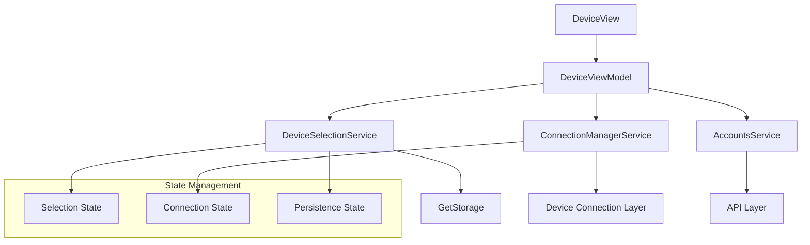
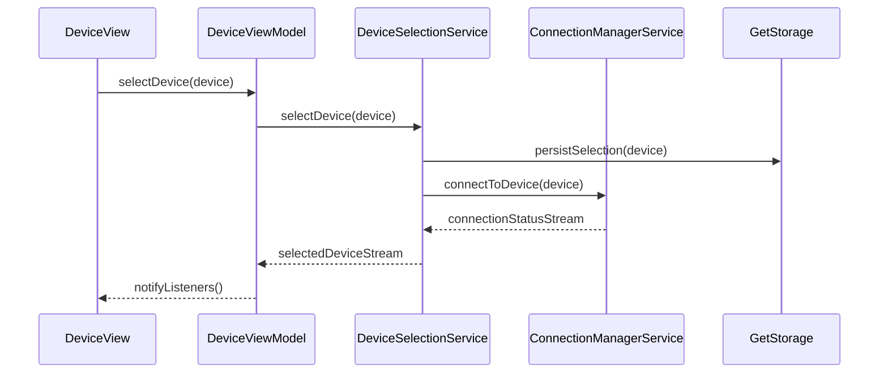

# Device Selection Enhancement - Design Document

## Overview

This design document outlines the technical implementation for enhancing the existing device pairing functionality in the Flutter app to include comprehensive device selection capabilities. The enhancement will transform the current read-only device list into an interactive selection interface that allows users to choose, connect to, and manage their preferred devices.

The solution builds upon the existing Stacked architecture and device management infrastructure, extending the current `DeviceView` and `DeviceViewModel` to support device selection, connection management, and persistent user preferences.

## Architecture

### High-Level Architecture

The device selection enhancement follows the existing Stacked MVVM pattern with these key architectural components:



### Service Layer Architecture

The enhancement introduces new services while leveraging existing ones:

- **DeviceSelectionService**: Manages device selection state and persistence
- **ConnectionManagerService**: Handles device connection lifecycle
- **AccountsService**: Existing service for device CRUD operations (enhanced)
- **GetStorage**: Local storage for selection persistence

### State Management Strategy

The solution uses Stacked's reactive state management with three distinct state layers:

1. **UI State**: Managed by `DeviceViewModel` for immediate UI updates
2. **Selection State**: Managed by `DeviceSelectionService` for selection logic
3. **Connection State**: Managed by `ConnectionManagerService` for connection status

## Components and Interfaces

### Core Components

#### 1. Enhanced DeviceView
- **Purpose**: Interactive device selection interface
- **Key Features**:
  - Selectable device cards with radio buttons
  - Visual selection indicators
  - Connection status displays
  - Enhanced skip functionality

#### 2. Enhanced DeviceViewModel
- **Purpose**: Orchestrates device selection logic
- **Key Responsibilities**:
  - Device selection state management
  - Connection initiation
  - UI state updates
  - Error handling

#### 3. DeviceSelectionService (New)
- **Purpose**: Centralized device selection management
- **Interface**:
```dart
abstract class IDeviceSelectionService {
  Device? get selectedDevice;
  Stream<Device?> get selectedDeviceStream;
  Future<void> selectDevice(Device device);
  Future<void> clearSelection();
  Future<Device?> getPersistedSelection();
  Future<void> persistSelection(Device device);
}
```

#### 4. ConnectionManagerService (New)
- **Purpose**: Device connection lifecycle management
- **Interface**:
```dart
abstract class IConnectionManagerService {
  ConnectionStatus getConnectionStatus(Device device);
  Stream<ConnectionStatus> getConnectionStatusStream(Device device);
  Future<ConnectionResult> connectToDevice(Device device);
  Future<void> disconnectFromDevice(Device device);
  Device? get activeDevice;
}
```

### Data Models

#### Enhanced Device Model
The existing `Device` model will be extended with selection and connection state:

```dart
extension DeviceSelection on Device {
  bool get isSelected;
  ConnectionStatus get connectionStatus;
}
```

#### New Models

```dart
enum ConnectionStatus {
  disconnected,
  connecting,
  connected,
  failed,
  offline
}

class ConnectionResult {
  final bool success;
  final String? errorMessage;
  final Device? device;
}

class DeviceSelectionState {
  final Device? selectedDevice;
  final Map<String, ConnectionStatus> connectionStates;
  final bool isLoading;
}
```

### UI Components

#### 1. SelectableDeviceCard
- **Purpose**: Interactive device card with selection controls
- **Features**:
  - Radio button selection
  - Connection status indicator
  - Haptic feedback
  - Visual selection highlighting

#### 2. ConnectionStatusIndicator
- **Purpose**: Visual connection status display
- **States**:
  - Connected (green badge)
  - Connecting (loading spinner)
  - Available (neutral state)
  - Offline (gray/disabled state)

#### 3. DeviceSelectionControls
- **Purpose**: Action buttons for device management
- **Components**:
  - "Continue with Selected Device" button
  - "Skip Device Selection" button
  - Connection retry controls

## Data Models

### Core Data Structures

#### Device Selection State
```dart
class DeviceSelectionState {
  final Device? selectedDevice;
  final Map<String, ConnectionStatus> deviceConnections;
  final bool isSelectionPersisted;
  final DateTime? lastSelectionTime;
  
  const DeviceSelectionState({
    this.selectedDevice,
    this.deviceConnections = const {},
    this.isSelectionPersisted = false,
    this.lastSelectionTime,
  });
}
```

#### Connection Configuration
```dart
class DeviceConfiguration {
  final Device device;
  final Map<String, dynamic> settings;
  final DateTime connectedAt;
  final String sessionId;
  
  const DeviceConfiguration({
    required this.device,
    required this.settings,
    required this.connectedAt,
    required this.sessionId,
  });
}
```

#### Persistence Model
```dart
class PersistedDeviceSelection {
  final String deviceId;
  final String deviceCode;
  final DateTime selectedAt;
  final bool autoConnect;
  
  const PersistedDeviceSelection({
    required this.deviceId,
    required this.deviceCode,
    required this.selectedAt,
    this.autoConnect = true,
  });
}
```

### Data Flow Architecture



## Error Handling

### Error Categories and Strategies

#### 1. Connection Errors
- **Timeout Errors**: Retry mechanism with exponential backoff
- **Network Errors**: Offline mode with cached selection
- **Device Unavailable**: Clear selection and show alternatives

#### 2. Selection Errors
- **Invalid Device**: Validation before selection
- **Persistence Errors**: Graceful degradation to session-only selection
- **State Conflicts**: Last-write-wins resolution

#### 3. UI Error Handling
- **Loading States**: Skeleton screens and progress indicators
- **Error Messages**: User-friendly error dialogs with retry options
- **Fallback UI**: Graceful degradation when services fail

### Error Recovery Mechanisms

```dart
class ErrorRecoveryStrategy {
  static Future<void> handleConnectionError(
    ConnectionError error,
    Device device,
  ) async {
    switch (error.type) {
      case ConnectionErrorType.timeout:
        await _retryConnection(device);
        break;
      case ConnectionErrorType.deviceUnavailable:
        await _clearSelectionAndShowAlternatives(device);
        break;
      case ConnectionErrorType.networkError:
        await _enableOfflineMode(device);
        break;
    }
  }
}
```

## Testing Strategy

### Testing Approach

The testing strategy employs a dual approach combining unit tests for specific functionality and integration tests for end-to-end workflows.

#### Unit Testing Focus Areas
- **Service Layer**: Device selection logic, connection management, persistence
- **ViewModel Logic**: State management, error handling, user interactions
- **UI Components**: Widget behavior, user input handling, visual states
- **Data Models**: Serialization, validation, state transitions

#### Integration Testing Focus Areas
- **Device Selection Flow**: Complete user journey from selection to connection
- **Persistence Integration**: Storage and retrieval of device preferences
- **Error Scenarios**: Network failures, device unavailability, timeout handling
- **State Synchronization**: Multi-service state consistency

#### Widget Testing Strategy
- **Device Card Interactions**: Selection, visual feedback, status updates
- **Navigation Flows**: Skip functionality, dashboard navigation
- **Error UI**: Error dialogs, retry mechanisms, fallback states

#### Test Configuration
- **Unit Tests**: Standard Flutter test framework with mocking
- **Widget Tests**: Flutter widget testing with golden file comparisons
- **Integration Tests**: Flutter integration test framework
- **Mock Services**: Comprehensive mocking for external dependencies

### Test Coverage Requirements
- **Minimum Coverage**: 80% for service layer, 70% for UI layer
- **Critical Path Coverage**: 95% for device selection and connection flows
- **Error Path Coverage**: 85% for error handling and recovery scenarios

### Testing Tools and Frameworks
- **Flutter Test**: Core testing framework
- **Mockito**: Service mocking and dependency injection
- **Golden Toolkit**: UI regression testing
- **Integration Test**: End-to-end workflow validation

## Correctness Properties

*A property is a characteristic or behavior that should hold true across all valid executions of a system-essentially, a formal statement about what the system should do. Properties serve as the bridge between human-readable specifications and machine-verifiable correctness guarantees.*

### Property 1: Single Device Selection Invariant

*For any* device selection system state and any sequence of device selection operations, only one device should be marked as selected at any given time.

**Validates: Requirements 1.4**

### Property 2: Successful Connection Behavior

*For any* device that successfully connects, the system should establish an active connection and update the device status to reflect the connected state.

**Validates: Requirements 2.2**

### Property 3: Connection Failure State Preservation

*For any* device connection attempt that fails, the system should display an error message and maintain the previous connection state without corruption.

**Validates: Requirements 2.3**

### Property 4: Configuration Storage Consistency

*For any* device that establishes a successful connection, the device configuration should be stored and remain accessible for the duration of the current session.

**Validates: Requirements 2.5**

### Property 5: Device Selection Persistence

*For any* device selection made by the user, the selection should be stored in local storage and persist across application sessions until explicitly changed.

**Validates: Requirements 4.3, 5.1, 5.5**

### Property 6: Selection Restoration Behavior

*For any* previously selected device, when the app reopens, the system should restore the selection if the device is available, or clear the selection and prompt for a new choice if the device is unavailable.

**Validates: Requirements 5.2, 5.3, 5.4**

### Property 7: Connection Error Handling

*For any* device connection failure, the system should display a descriptive error message and provide retry options to the user.

**Validates: Requirements 7.1, 7.2**

### Property 8: Device Unavailability Handling

*For any* device that becomes unavailable during active use, the system should alert the user and offer alternative device options.

**Validates: Requirements 7.4**

### Property 9: Error Logging Consistency

*For any* connection error that occurs, the system should log the error for debugging purposes while maintaining user privacy and data protection standards.

**Validates: Requirements 7.5**