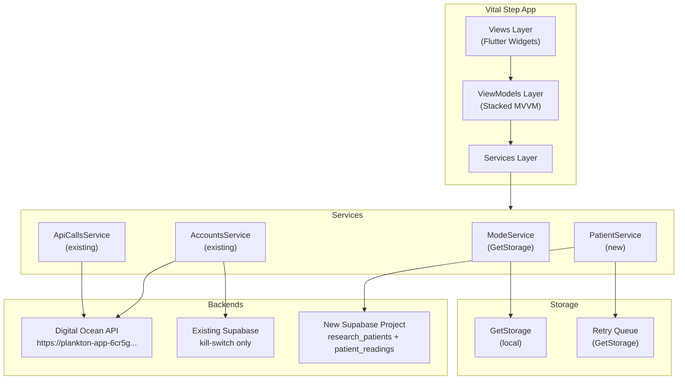
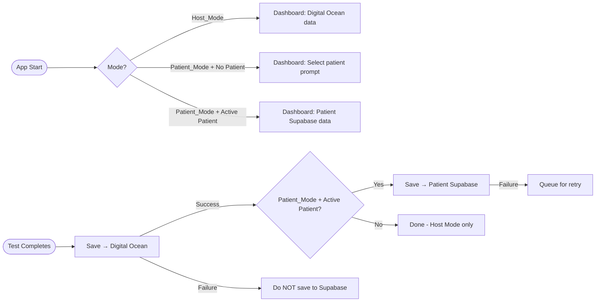

# Design Document: Multi-Patient Session Management

## Overview

This design introduces a dual-mode operation system to the Vital Step application, enabling clinics and research facilities to manage multiple patient profiles while preserving all existing functionality. The feature adds Patient Mode alongside the existing Host Mode (default), allowing test data to be collected, tracked, and exported on a per-patient basis while maintaining isolation between different clinic devices.

### Key Design Principles

1. **Backward Compatibility**: All existing functionality remains unchanged when operating in Host Mode (the default).
2. **Data Isolation**: Each device (identified by Host_User_Id) maintains its own patient registry with no cross-contamination.
3. **Dual-Write Pattern**: Test data is saved to both Digital Ocean backend (existing) and New Supabase Project (patient-specific) when in Patient Mode with an active patient selected.
4. **Offline Resilience**: Network failures are handled gracefully with queueing and retry mechanisms.
5. **UI Consistency**: The app maintains the same look and feel in both modes, with patient-specific UI elements appearing only when Patient Mode is active.

### Architecture Decisions

**Decision 1: Separate Supabase Client for Patient Data**
- Rationale: The existing Supabase instance is only used for kill-switch functionality. Adding patient tables would couple research data with production control systems. A separate Supabase project ensures clean separation and independent scaling.
- Alternative Considered: Using the existing Supabase instance was rejected due to concerns about coupling and future migration complexity.

**Decision 2: Dual-Write Pattern Instead of Event-Driven**
- Rationale: Synchronous dual-write ensures immediate consistency and simplifies error handling. Since both writes complete in the same transaction context, we can queue for retry if the patient write fails.
- Alternative Considered: Event-driven architecture with message queues was rejected due to added complexity and the need for additional infrastructure.

**Decision 3: GetStorage for Mode and Active Patient State**
- Rationale: GetStorage is already used throughout the app for session state (userId, cookie, etc.). Using the same storage mechanism ensures consistency and leverages existing patterns.
- Alternative Considered: Using Hive or SharedPreferences was rejected because GetStorage is already initialized and working well in the codebase.


---

## Architecture

### System Architecture Diagram



### Mode Routing Architecture



### Supabase Client Initialization Strategy

Two separate Supabase clients coexist in `main.dart`:

1. **`Supabase.instance.client`** (existing) — the named default instance, used by `AccountsService.killApp()` for kill-switch only. URL: `https://aoujgxqgixpanztyyshc.supabase.co`

2. **`patientSupabaseClient`** (new global) — a plain `SupabaseClient` initialized directly (not via `Supabase.initialize()` which only supports one instance). This is exposed as a global or injected into `PatientService`.

```dart
// main.dart (addition)
import 'package:supabase_flutter/supabase_flutter.dart';

late final SupabaseClient patientSupabaseClient;

Future<void> main() async {
  WidgetsFlutterBinding.ensureInitialized();
  
  // Existing Supabase (kill-switch)
  await Supabase.initialize(url: '...existing...', anonKey: '...existing...');
  
  // New patient Supabase client (second instance via direct constructor)
  patientSupabaseClient = SupabaseClient(
    const String.fromEnvironment('PATIENT_SUPABASE_URL',
        defaultValue: 'https://YOUR_NEW_PROJECT.supabase.co'),
    const String.fromEnvironment('PATIENT_SUPABASE_ANON_KEY',
        defaultValue: 'YOUR_NEW_ANON_KEY'),
  );
  
  // ... rest of main unchanged
}
```

The URL/anon key are supplied via `--dart-define` at build time:
```bash
flutter run \
  --dart-define=PATIENT_SUPABASE_URL=https://xyzxyz.supabase.co \
  --dart-define=PATIENT_SUPABASE_ANON_KEY=eyJ...
```


---

## Components and Interfaces

### New Services

#### `ModeService`

Manages the Host/Patient mode selection and the Active Patient state, persisted via GetStorage. Registered as a `LazySingleton` in `app.dart`.

```dart
// lib/services/mode_service.dart
class ModeService {
  final _box = GetStorage();
  
  static const String _modeKey = 'app_mode';
  static const String _activePatientIdKey = 'active_patient_id';
  static const String _activePatientCodeKey = 'active_patient_code';
  static const String _activePatientNameKey = 'active_patient_name';

  /// Returns true if currently in Patient Mode, false for Host Mode
  bool get isPatientMode => _box.read<bool>(_modeKey) ?? false;
  
  /// Returns true if currently in Host Mode (default)
  bool get isHostMode => !isPatientMode;

  void setPatientMode(bool value) {
    _box.write(_modeKey, value);
    if (!value) clearActivePatient(); // Clear patient on switching back to Host
  }

  String? get activePatientId => _box.read<String>(_activePatientIdKey);
  String? get activePatientCode => _box.read<String>(_activePatientCodeKey);
  String? get activePatientName => _box.read<String>(_activePatientNameKey);

  bool get hasActivePatient => activePatientId != null && activePatientId!.isNotEmpty;

  void setActivePatient({
    required String patientId,
    required String patientCode,
    required String patientName,
  }) {
    _box.write(_activePatientIdKey, patientId);
    _box.write(_activePatientCodeKey, patientCode);
    _box.write(_activePatientNameKey, patientName);
  }

  void clearActivePatient() {
    _box.remove(_activePatientIdKey);
    _box.remove(_activePatientCodeKey);
    _box.remove(_activePatientNameKey);
  }
}
```

#### `PatientService`

All patient CRUD operations and the retry queue. Uses the `patientSupabaseClient` global. Registered as a `LazySingleton` in `app.dart`.

```dart
// lib/services/patient_service.dart
class PatientService {
  final SupabaseClient _client = patientSupabaseClient;
  final _box = GetStorage();
  final _loginService = locator<LoginService>();
  
  static const String _retryQueueKey = 'patient_readings_retry_queue';

  // ── Patient Registration ─────────────────────────────────────────────────
  Future<ResearchPatient> registerPatient(PatientRegistrationData data) async { ... }
  
  // ── Patient Search ───────────────────────────────────────────────────────
  Future<List<ResearchPatient>> searchPatients(String query) async { ... }
  
  // ── Patient Fetch ────────────────────────────────────────────────────────
  Future<ResearchPatient?> getPatient(String patientId) async { ... }
  
  // ── Patient Code Generation ──────────────────────────────────────────────
  Future<String> getNextPatientCode(String hostUserId) async { ... }
  
  // ── Readings ─────────────────────────────────────────────────────────────
  Future<void> saveReading(PatientReadingData data) async { ... }
  Future<List<PatientReading>> getReadings(String patientId) async { ... }
  
  // ── Retry Queue ──────────────────────────────────────────────────────────
  void enqueueReading(PatientReadingData data) { ... }
  Future<void> processRetryQueue() async { ... }
  
  // ── CSV Export ───────────────────────────────────────────────────────────
  Future<String> exportCSV(String patientId) async { ... }
}
```

### Modified Services

#### `TestResultViewModel` — Dual-Write Integration

After the existing Digital Ocean save (currently happens in `TestTakingViewModel` via `ApiCallsService`), a post-save hook checks the mode and writes to `PatientService`:

```dart
// Pseudo-code addition to TestTakingViewModel (wherever test creation completes)
Future<void> _handleDualWrite(Test savedTest) async {
  final modeService = locator<ModeService>();
  if (!modeService.isPatientMode || !modeService.hasActivePatient) return;

  final patientService = locator<PatientService>();
  try {
    await patientService.saveReading(PatientReadingData(
      patientId: modeService.activePatientId!,
      hostUserId: (await locator<LoginService>().getUserId())!,
      trial1: savedTest.trial1,
      trial2: savedTest.trial2,
      trial3: savedTest.trial3,
      hand: savedTest.hand,
      posture: savedTest.posture,
      assessmentType: savedTest.assestmentId.toString(),
    ));
  } catch (e) {
    // Non-blocking: queue for retry, show toast
    patientService.enqueueReading(...);
    Fluttertoast.showToast(msg: 'Patient data queued for sync');
  }
}
```

#### `DashboardViewModel` — Data Source Switching

```dart
Future<void> refreshData() async {
  final modeService = locator<ModeService>();
  
  if (modeService.isPatientMode && modeService.hasActivePatient) {
    final patientService = locator<PatientService>();
    final readings = await patientService.getReadings(modeService.activePatientId!);
    _allTests = readings.map((r) => r.toTest()).toList();
  } else {
    _allTests = await _apiCallsService.getAllUserTests(); // existing
  }
  _calculateStats();
  notifyListeners();
}
```

#### `HomeTabViewModel` — Same Data Source Switch

`HomeTabViewModel.refreshData()` mirrors the same pattern as `DashboardViewModel`.

### New Views

| View | ViewModel | Route Name | Purpose |
|---|---|---|---|
| `PatientSearchView` | `PatientSearchViewModel` | `patientSearchView` | Search bar + recent patients list |
| `PatientRegistrationView` | `PatientRegistrationViewModel` | `patientRegistrationView` | Registration form with validation |
| `PatientSessionView` | `PatientSessionViewModel` | `patientSessionView` | Profile display + test history + CSV export |
| `PatientHistoryView` | `PatientHistoryViewModel` | `patientHistoryView` | Chart + full session list |
| `PatientEditView` | `PatientEditViewModel` | `patientEditView` | Edit existing patient profile |

### Settings Integration

`AccountView` gains a new settings group between "My Devices" and "Contact Support":

```dart
_buildSettingsGroup([
  _buildModeSwitchItem(viewModel),  // New toggle item
]),
```

The toggle item uses a `Switch` widget bound to `AccountViewModel.isPatientMode` which calls `ModeService.setPatientMode()`.


---

## Data Models

### App-Side Models (Dart)

#### `ResearchPatient`

```dart
// lib/Model/research_patient.dart
class ResearchPatient {
  final String id;              // uuid
  final String patientCode;     // PT-0001
  final String name;
  final int age;
  final String gender;
  final String contact;
  final String notes;
  final String hostUserId;
  final DateTime createdAt;

  ResearchPatient({
    required this.id,
    required this.patientCode,
    required this.name,
    required this.age,
    required this.gender,
    required this.contact,
    required this.notes,
    required this.hostUserId,
    required this.createdAt,
  });

  factory ResearchPatient.fromJson(Map<String, dynamic> json) => ResearchPatient(
    id: json['id'],
    patientCode: json['patient_code'],
    name: json['name'],
    age: json['age'],
    gender: json['gender'],
    contact: json['contact'] ?? '',
    notes: json['notes'] ?? '',
    hostUserId: json['host_user_id'],
    createdAt: DateTime.parse(json['created_at']),
  );

  Map<String, dynamic> toJson() => {
    'id': id, 'patient_code': patientCode, 'name': name,
    'age': age, 'gender': gender, 'contact': contact,
    'notes': notes, 'host_user_id': hostUserId,
    'created_at': createdAt.toIso8601String(),
  };
}
```

#### `PatientReading`

```dart
// lib/Model/patient_reading.dart
class PatientReading {
  final String id;            // uuid
  final String patientId;     // FK → research_patients.id
  final double trial1;
  final double trial2;
  final double trial3;
  final String hand;
  final String posture;
  final String assessmentType;
  final String hostUserId;
  final DateTime createdAt;

  double get average => (trial1 + trial2 + trial3) / 3;

  PatientReading({ ... });

  factory PatientReading.fromJson(Map<String, dynamic> json) => PatientReading(
    id: json['id'],
    patientId: json['patient_id'],
    trial1: (json['trial1'] as num).toDouble(),
    trial2: (json['trial2'] as num).toDouble(),
    trial3: (json['trial3'] as num).toDouble(),
    hand: json['hand'],
    posture: json['posture'],
    assessmentType: json['assessment_type'],
    hostUserId: json['host_user_id'],
    createdAt: DateTime.parse(json['created_at']),
  );

  /// Adapter: convert to existing Test model for reuse in Dashboard charts
  Test toTest() => Test(
    id: 0, // Supabase-origin, no integer id
    userId: 0,
    deviceId: 0,
    assestmentId: 0,
    posture: posture,
    trial1: trial1.toString(),
    trial2: trial2.toString(),
    trial3: trial3.toString(),
    hand: hand,
    createdAt: createdAt,
  );
}
```

#### `PatientRegistrationData` & `PatientReadingData`

Transfer objects used to pass form data into `PatientService`:

```dart
class PatientRegistrationData {
  final String name;       // max 100 chars
  final int age;           // 0–150
  final String gender;
  final String contact;    // max 50 chars
  final String notes;      // max 500 chars
  // hostUserId injected by service from LoginService
}

class PatientReadingData {
  final String patientId;
  final String hostUserId;
  final String trial1;
  final String trial2;
  final String trial3;
  final String hand;
  final String posture;
  final String assessmentType;
}
```

### Database Schema (New Supabase Project)

```sql
-- ─── TABLE: research_patients ───────────────────────────────────────────────
CREATE TABLE research_patients (
  id             UUID PRIMARY KEY DEFAULT gen_random_uuid(),
  patient_code   TEXT NOT NULL,
  name           TEXT NOT NULL,
  age            INTEGER NOT NULL CHECK (age >= 0 AND age <= 150),
  gender         TEXT NOT NULL,
  contact        TEXT DEFAULT '',
  notes          TEXT DEFAULT '',
  host_user_id   TEXT NOT NULL,
  created_at     TIMESTAMPTZ NOT NULL DEFAULT NOW(),

  CONSTRAINT unique_patient_code_per_host UNIQUE (patient_code, host_user_id)
);

CREATE INDEX idx_research_patients_host_user_id ON research_patients (host_user_id);

-- ─── TABLE: patient_readings ─────────────────────────────────────────────────
CREATE TABLE patient_readings (
  id              UUID PRIMARY KEY DEFAULT gen_random_uuid(),
  patient_id      UUID NOT NULL REFERENCES research_patients(id) ON DELETE CASCADE,
  trial1          NUMERIC(10, 2) NOT NULL,
  trial2          NUMERIC(10, 2) NOT NULL,
  trial3          NUMERIC(10, 2) NOT NULL,
  hand            TEXT NOT NULL,
  posture         TEXT NOT NULL,
  assessment_type TEXT NOT NULL,
  host_user_id    TEXT NOT NULL,
  created_at      TIMESTAMPTZ NOT NULL DEFAULT NOW()
);

CREATE INDEX idx_patient_readings_patient_id  ON patient_readings (patient_id);
CREATE INDEX idx_patient_readings_host_user_id ON patient_readings (host_user_id);

-- Row Level Security (recommended)
ALTER TABLE research_patients ENABLE ROW LEVEL SECURITY;
ALTER TABLE patient_readings  ENABLE ROW LEVEL SECURITY;

-- Policy: anon key can read/write only where host_user_id matches app-provided header
-- (This can be enforced in app layer as a secondary defense)
```

### GetStorage Key Map

| Key | Type | Purpose |
|---|---|---|
| `app_mode` | `bool` | `false` = Host_Mode (default), `true` = Patient_Mode |
| `active_patient_id` | `String?` | UUID of currently selected patient |
| `active_patient_code` | `String?` | PT-XXXX code for display |
| `active_patient_name` | `String?` | Patient name for display in header |
| `patient_readings_retry_queue` | `List<Map>` | Serialized `PatientReadingData` pending retry |

### App Name & Icon Changes

**`pubspec.yaml` changes:**
```yaml
name: vital_step_data_collection          # was: vital_step
description: "Vital Step Data Collection" # was: "A new Flutter project."
```

**Icon generation — `assets/Logo3_datacollection.png`:**

The tinted/desaturated icon is created by wrapping the original asset in a `ColorFiltered` widget with a greyscale color matrix during development, then exporting to a PNG. Two approaches:

1. **Manual (Recommended):** Use an image editor (GIMP, Figma, Photoshop) to:
   - Open `assets/Logo3.png`
   - Apply Hue/Saturation desaturation (−80 to −100)
   - Apply a blue-teal tint overlay at 20–30% opacity using color `#00796B` (kcPrimaryColor)
   - Export as `assets/Logo3_datacollection.png`

2. **Flutter ColorFiltered approach (for generating via screenshot):**
   ```dart
   ColorFiltered(
     colorFilter: ColorFilter.matrix([
       0.2126, 0.7152, 0.0722, 0, 0,  // R → greyscale
       0.2126, 0.7152, 0.0722, 0, 0,  // G → greyscale
       0.2126, 0.7152, 0.0722, 0, 0,  // B → greyscale
       0, 0, 0, 1, 0,
     ]),
     child: Image.asset('assets/Logo3.png'),
   )
   ```

**`flutter_launcher_icons.yaml` changes:**
```yaml
flutter_launcher_icons:
  android: true
  ios: true
  image_path: "assets/Logo3_datacollection.png"
  min_sdk_android: 21
```

Run icon generation after updating: `flutter pub run flutter_launcher_icons`


---

## Correctness Properties

*A property is a characteristic or behavior that should hold true across all valid executions of a system — essentially, a formal statement about what the system should do. Properties serve as the bridge between human-readable specifications and machine-verifiable correctness guarantees.*

**Property Reflection Summary:**
After reviewing all prework analysis items, the following consolidations were made:
- Properties for "search by name" and "search by code" (3.2, 3.3) are combined into one search filtering property since the same filter mechanism applies to both fields.
- Properties for "mode persistence" (1.7) and "active patient persistence" (3.6-3.7) are combined as both test the same GetStorage round-trip pattern.
- Properties for "multi-device isolation" (8.1–8.6) are combined into a single data-isolation property since all share the same host_user_id filter invariant.
- Properties for "form field validation" (2.2–2.6) are combined into one field-length-validation property.

---

### Property 1: Mode Persistence Round-Trip

*For any* boolean mode value written to `ModeService`, reading the mode back (as would happen after an app restart) must return the same value.

**Validates: Requirements 1.7, 1.8**

---

### Property 2: Patient UI Visibility Invariant

*For any* patient management UI element (patient search, registration, session views), that element must be visible when Patient Mode is active and hidden when Host Mode is active.

**Validates: Requirements 1.2, 1.4**

---

### Property 3: Patient Search Filtering Completeness

*For any* non-empty search query string `Q` and any list of `ResearchPatient` objects, the search filter function must return only patients whose `patientCode` or `name` contains `Q` as a case-insensitive substring, and must never return a patient that does not contain `Q` in either field.

**Validates: Requirements 3.2, 3.3**

---

### Property 4: Host User Id Data Isolation Invariant

*For any* query to `research_patients` or `patient_readings`, every row returned must have `hostUserId` equal to the currently logged-in user's ID. No row with a different `hostUserId` may appear in any result set.

**Validates: Requirements 3.4, 8.1, 8.2, 8.3, 8.4, 8.5, 8.6**

---

### Property 5: Patient Code Sequential Format

*For any* sequence index `n` in the range `[1, 9999]`, the `PatientService.getNextPatientCode()` function must produce a string matching the pattern `PT-NNNN` where `NNNN` is `n` zero-padded to exactly 4 digits.

**Validates: Requirements 2.7, 12.1, 12.2**

---

### Property 6: Patient Code Uniqueness Per Host

*For any* list of registered patients under the same `hostUserId`, all `patientCode` values must be distinct. Patients registered under different `hostUserId` values may share the same code.

**Validates: Requirements 2.8, 12.5**

---

### Property 7: Patient Registration Round-Trip

*For any* valid `PatientRegistrationData`, calling `registerPatient()` followed by `getPatient(id)` must return a `ResearchPatient` whose `name`, `age`, `gender`, `contact`, `notes`, and `hostUserId` exactly match the input data.

**Validates: Requirements 2.9**

---

### Property 8: Form Field Length Validation

*For any* text string longer than its field's maximum length (100 for name, 50 for contact, 500 for notes), the form validation must reject the input. *For any* text string at or below the maximum length, validation must accept it.

**Validates: Requirements 2.2, 2.5, 2.6**

---

### Property 9: Dual-Write Data Fidelity

*For any* completed test reading (with any combination of trial values, hand, posture, and assessment type) saved when Patient Mode is active with an active patient selected, the `PatientReadingData` passed to `PatientService.saveReading()` must contain values for all required fields — `trial1`, `trial2`, `trial3`, `hand`, `posture`, `assessmentType`, `patientId`, and `hostUserId` — that exactly match the corresponding fields of the original test record.

**Validates: Requirements 4.2, 4.3**

---

### Property 10: Test Session Sorting Invariant

*For any* list of `PatientReading` records retrieved from `getReadings()`, the records must be ordered by `createdAt` in descending order (most recent first).

**Validates: Requirements 6.3**

---

### Property 11: Average Calculation Correctness

*For any* `PatientReading` with trial values `t1`, `t2`, `t3`, the `average` getter must equal `(t1 + t2 + t3) / 3.0` exactly (within floating-point precision).

**Validates: Requirements 6.5**

---

### Property 12: CSV Row Completeness

*For any* list of `PatientReading` records, the CSV string generated by `exportCSV()` must contain exactly one data row per reading, and each row must have non-empty values for all required columns: `Patient_Code`, `Name`, `Age`, `Gender`, `Contact`, `Test_Date`, `Hand`, `Posture`, `Trial_1_Kg`, `Trial_2_Kg`, `Trial_3_Kg`, `Average_Kg`.

**Validates: Requirements 7.3, 7.4**

---

### Property 13: CSV Filename Format

*For any* patient code string `P` and export date `D`, the filename produced must match the pattern `{P}_{YYYY-MM-DD}.csv` where `YYYY-MM-DD` is `D` formatted in ISO date format.

**Validates: Requirements 7.5**

---

### Property 14: Retry Backoff Schedule

*For any* attempt index `n` in `[1, 5]`, the retry delay computed by the retry scheduler must equal `2^n` seconds (i.e., 2s, 4s, 8s, 16s, 32s).

**Validates: Requirements 11.4**

---

### Property 15: Search Result Display Completeness

*For any* `ResearchPatient` object returned by search, the rendered search result widget must display the `patientCode`, `name`, `age`, and `gender` fields.

**Validates: Requirements 3.5**


---

## Error Handling

### Network Failure Categories

| Scenario | Handling |
|---|---|
| DO backend offline during test save | Show existing error behavior; do NOT invoke PatientService |
| Supabase offline during test save (after DO success) | Enqueue `PatientReadingData` in retry queue; show non-blocking toast "Patient data queued for sync" |
| Supabase offline during patient registration | Show error dialog; retain form data for retry; offer manual retry button |
| Supabase offline during patient search | Show cached/empty state with "Offline" indicator; disable search while offline |
| Retry queue item fails all 5 attempts | Log failure with full details; notify user via persistent banner in Patient Mode |

### Retry Queue Implementation

The retry queue is stored in GetStorage as a JSON list under key `patient_readings_retry_queue`. Each entry contains the full `PatientReadingData` plus metadata:

```json
{
  "patientId": "uuid",
  "hostUserId": "123",
  "trial1": "25.5",
  "trial2": "26.0",
  "trial3": "24.8",
  "hand": "Right",
  "posture": "Seated",
  "assessmentType": "42",
  "enqueuedAt": "2024-01-15T10:30:00Z",
  "attemptCount": 0,
  "nextRetryAt": "2024-01-15T10:30:02Z"
}
```

The `ConnectionManagerService` (already registered in the locator) should trigger `PatientService.processRetryQueue()` when connectivity is restored.

### Exponential Backoff Schedule

| Attempt | Delay |
|---|---|
| 1st | 2 seconds |
| 2nd | 4 seconds |
| 3rd | 8 seconds |
| 4th | 16 seconds |
| 5th | 32 seconds |
| After 5th | Mark as permanently failed; log and notify |

### DO Save Guard

The dual-write explicitly checks the Digital Ocean save result before proceeding:

```dart
Future<void> onTestCompleted(Test savedTest) async {
  // Only call PatientService if DO save already returned success
  // (this is called from the success path, never from the catch block)
  await _handleDualWrite(savedTest);
}
```

This satisfies Requirement 4.4 — Supabase write is never attempted if DO write fails.

### Form Validation Errors

`PatientRegistrationViewModel` validates all fields before calling `registerPatient()`:

```dart
String? validateName(String? v) {
  if (v == null || v.trim().isEmpty) return 'Name is required';
  if (v.trim().length > 100) return 'Name must be 100 characters or less';
  return null;
}

String? validateAge(String? v) {
  final age = int.tryParse(v ?? '');
  if (age == null) return 'Age must be a number';
  if (age < 0 || age > 150) return 'Age must be between 0 and 150';
  return null;
}
```

If registration fails after validation due to network error, the form data is preserved in the ViewModel (not cleared) and an error snackbar is shown.


---

## Testing Strategy

This feature employs a **dual testing approach**: unit tests for specific examples and edge cases, and property-based tests for universal properties across all inputs.

### Unit Tests

Unit tests verify specific behaviors, integration points, and edge cases:

**Coverage:**
- Mode toggle UI exists in `AccountView` (Req 1.1)
- Host Mode data source uses `ApiCallsService` (Req 1.3)
- Patient Mode + active patient uses `PatientService` (Req 1.5)
- Patient Mode + no patient shows prompt (Req 1.6)
- Default mode is Host on first install (Req 1.8)
- Patient registration form exists (Req 2.1)
- Search interface exists (Req 3.1)
- DO save failure prevents Supabase write (Req 4.4)
- Supabase failure enqueues for retry (Req 4.5)
- CSV header row contains all required columns (Req 7.3)
- Device_ID remains unchanged (Req 10.4)

**Example test structure:**
```dart
// test/viewmodels/dashboard_viewmodel_test.dart
test('Dashboard uses ApiCallsService when in Host Mode', () async {
  final modeService = getAndRegisterModeService(isPatientMode: false);
  final apiService = getAndRegisterApiCallsService();
  
  final vm = DashboardViewModel();
  await vm.refreshData();
  
  verify(apiService.getAllUserTests()).called(1);
  verifyNever(patientService.getReadings(any));
});
```

### Property-Based Tests

Property-based tests validate universal properties using generated inputs. The Dart ecosystem provides **`test`** with **`check`** for lightweight property testing.

**Dependencies (add to `pubspec.yaml`):**
```yaml
dev_dependencies:
  checks: ^0.3.0  # provides property-based testing primitives
```

**Property Test Configuration:**
- **Minimum 100 iterations per property** (per requirements)
- Each test references its design property in a comment tag
- Use `check()` from the `checks` package for assertions

**Example property test:**
```dart
// test/services/patient_service_property_test.dart
import 'package:checks/checks.dart';
import 'package:test/test.dart';

/// Feature: multi-patient-session-management, Property 7: Patient Registration Round-Trip
test('Property 7: Patient registration round-trip preserves all fields', () async {
  await checkAsync<PatientRegistrationData>(
    (data) async {
      final service = PatientService();
      final registered = await service.registerPatient(data);
      final fetched = await service.getPatient(registered.id);
      
      check(fetched).isNotNull();
      check(fetched!.name).equals(data.name);
      check(fetched.age).equals(data.age);
      check(fetched.gender).equals(data.gender);
      check(fetched.contact).equals(data.contact);
      check(fetched.notes).equals(data.notes);
    },
    count: 100, // minimum required iterations
  );
});
```

**Generator Functions:**

Property tests require custom generators for domain objects:

```dart
// test/generators/patient_generators.dart
import 'package:faker/faker.dart';
import 'dart:math';

PatientRegistrationData randomPatientData() => PatientRegistrationData(
  name: faker.person.name().substring(0, min(faker.person.name().length, 100)),
  age: Random().nextInt(151), // 0-150
  gender: Random().nextBool() ? 'Male' : 'Female',
  contact: faker.phoneNumber.toString().substring(0, min(50, faker.phoneNumber.toString().length)),
  notes: faker.lorem.sentence().substring(0, min(500, faker.lorem.sentence().length)),
);
```

### Integration Tests

Integration tests verify infrastructure and database behavior:

- Supabase table schemas match specification (Req 9.1–9.9)
- Row-level security policies work correctly
- Search performance under 10,000 records (Req 3.8)
- Concurrent patient registrations handled by unique constraint (Req 12.5)
- Kill-switch still works from Existing Supabase (Req 10.3)

**Example integration test:**
```dart
// integration_test/supabase_schema_test.dart
testWidgets('research_patients table has all required columns', (tester) async {
  final client = patientSupabaseClient;
  
  // Attempt to insert a full record to validate schema
  final result = await client.from('research_patients').insert({
    'patient_code': 'PT-TEST',
    'name': 'Test Patient',
    'age': 30,
    'gender': 'Male',
    'contact': 'test@example.com',
    'notes': '',
    'host_user_id': '999',
  }).select().single();
  
  expect(result['id'], isNotNull);
  expect(result['created_at'], isNotNull);
});
```

### Smoke Tests

Smoke tests verify one-time setup and configuration:

- App defaults to Host Mode on first run (Req 1.8)
- `patientSupabaseClient` initializes without error
- Database tables exist in New Supabase Project (Req 9.1, 9.5)

### Test Coverage Summary

| Requirement Category | Unit Tests | Property Tests | Integration Tests | Smoke Tests |
|---|---|---|---|---|
| Mode Management (Req 1) | 6 | 1 | — | 1 |
| Patient Registration (Req 2) | 3 | 4 | 1 | — |
| Patient Search (Req 3) | 2 | 4 | 1 | — |
| Dual-Write (Req 4) | 4 | 1 | — | — |
| Dashboard Switching (Req 5) | 3 | 1 | — | — |
| Session View (Req 6) | 2 | 2 | — | — |
| CSV Export (Req 7) | 2 | 2 | — | — |
| Data Isolation (Req 8) | — | 1 | 2 | — |
| Database Schema (Req 9) | — | — | 4 | 1 |
| Backward Compatibility (Req 10) | 3 | — | 1 | — |
| Error Handling (Req 11) | 4 | 1 | — | — |
| Patient Code Gen (Req 12) | 1 | 2 | 1 | — |
| **TOTAL** | **30** | **19** | **10** | **2** |

### Mocking Strategy

**Services to mock in unit tests:**
- `ModeService` → return stubbed mode/active patient
- `LoginService` → return stubbed userId
- `ApiCallsService` → mock getAllUserTests()
- `PatientService` → mock getReadings(), saveReading()
- `patientSupabaseClient` → mock all Supabase calls

Use **Mockito** (already in dev_dependencies) for service mocks.

